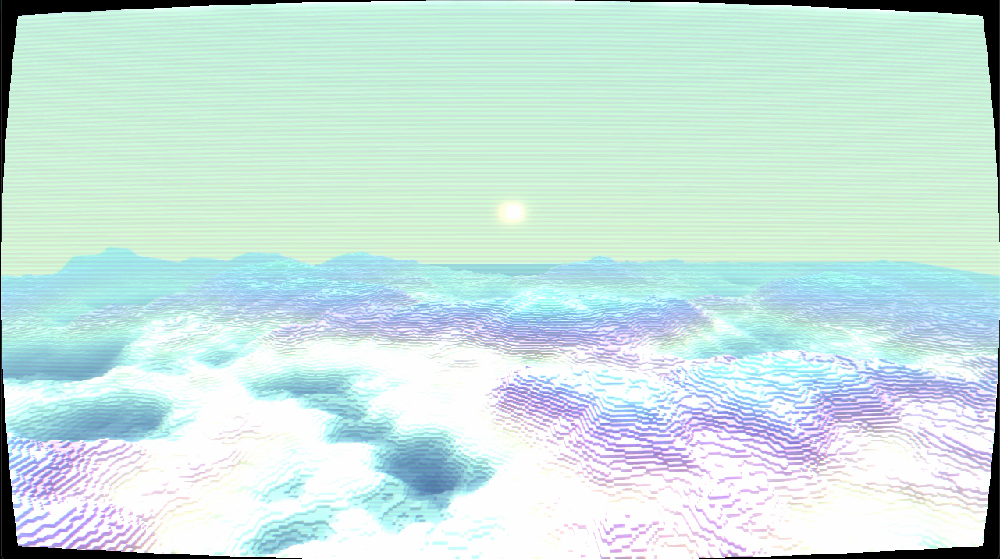

# VX

This is a voxel engine written in Python using Pygame and ModernGL. <br />
I followed this amazing [tutorial](https://www.youtube.com/watch?v=Ab8TOSFfNp4) from Coder Space, and then deviated to experiment with various rendering techniques, hopefully to create a more unique and interesting visual. <br />

### Demo
https://www.youtube.com/watch?v=st6FL2xLPZE


## Getting Started
### Prerequisites
- [Python 3](https://www.python.org/downloads/)
- [UV](https://docs.astral.sh/uv/)
### Run
```sh
uv run main.py
```


## Roadmap
- [ ] Texture atlas and PBR materials
- [ ] Lights and IBL
- [ ] Light temperature
- [ ] Sun scattering fog
- [ ] Add capsule collider and terrain collision
- [ ] Switch between fly cam and first person cam


## License
This project is distributed under the Unlicense License. See `LICENSE.txt` for more information.

Note: The VHS post-processing shader (`shaders/post_vhs.frag`) is licensed under CC BY-NC-SA 4.0, forked from [Ryk's VCR distortion shader](https://www.shadertoy.com/view/ldjGzV).